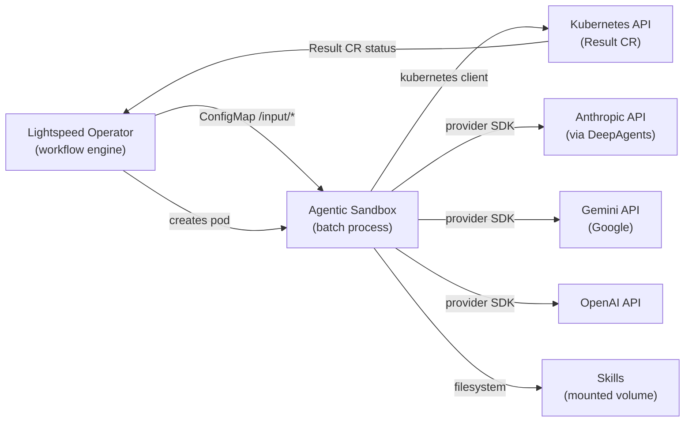
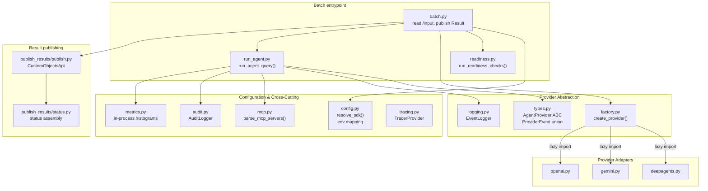
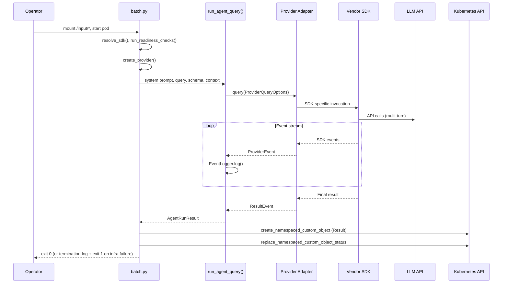
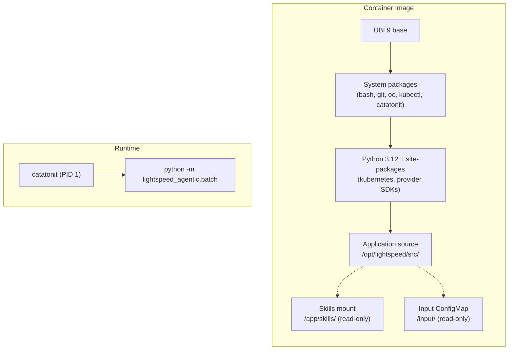

# Architecture

The lightspeed-agentic-sandbox is a multi-provider agent runtime for OpenShift Lightspeed. It runs as a **one-shot batch process** inside ephemeral Kubernetes pods: the operator mounts input files, the sandbox runs the agent, publishes a Result CR via the Kubernetes API, and exits.

## System Context

The sandbox sits between the operator (workflow engine) and the LLM provider APIs. Each pod processes one AgenticRun step and is disposable.

There is **no HTTP server** in the sandbox — no FastAPI, no `/health`, `/ready`, or `/v1/agent/run`.

## Internal Architecture

## Batch Run Flow

Result CR lifecycle uses the **`kubernetes` Python client** (`CustomObjectsApi`), not `oc` subprocesses. The image still ships `oc` and `kubectl` for **agent tool execution** (delegated to provider SDKs).

## Provider Adapter Design

Each adapter is a thin wrapper. The SDK owns tool execution, skill discovery, and multi-turn orchestration. Adapters map SDK events to normalized `ProviderEvent` objects and extract token usage.

| Provider | SDK | Structured Output | Skills | Tools |
|---|---|---|---|---|
| DeepAgents | `deepagents` + `langchain-anthropic` | `ProviderStrategy` when thinking configured, else `ToolStrategy` via `response_format` | Skills dirs passed to `create_deep_agent()` | `LocalShellBackend` + MCP tools |
| Gemini | `google-adk` | Response schema on content config | `SkillToolset` from directory | `ExecuteBashTool` + web tools |
| OpenAI | `openai-agents` | `output_type` wrapper | `Skills` capability | `SandboxAgent` shell/filesystem |

## Container & Deployment

The sandbox ships as a container image built with Konflux hermetic builds (dependencies prefetched, no network during build).

The container runs as non-root user `agent`. `catatonit` is PID 1. The batch module reads `/input/`, runs the agent, publishes the Result CR, and exits — no listener port.

## Key Decisions

- **One provider per pod:** Selected at startup via `LIGHTSPEED_PROVIDER` (mapped to an SDK name by `config.resolve_sdk()`).

- **Thin adapters:** Provider modules map SDK events to a normalized union type; they do not re-implement SDK behavior.

- **Lazy SDK imports:** The factory uses lazy imports so the base package loads without any vendor SDK installed.

- **Kubernetes API for Result CRs:** `publish_results/publish.py` uses the `kubernetes` Python client — not `oc create` / `oc patch`. Inside a pod (`KUBERNETES_SERVICE_HOST` set), authentication MUST use in-cluster config only; if that fails, publish fails and kubeconfig MUST NOT be consulted. Outside a cluster (local dev/tests), kubeconfig MAY be used when in-cluster config is unavailable.

- **Hermetic builds:** Python wheels and RPMs are lockfile-prefetched. `oc`/`kubectl` are copied from Red Hat image stages for agent tools, not for sandbox infrastructure.
